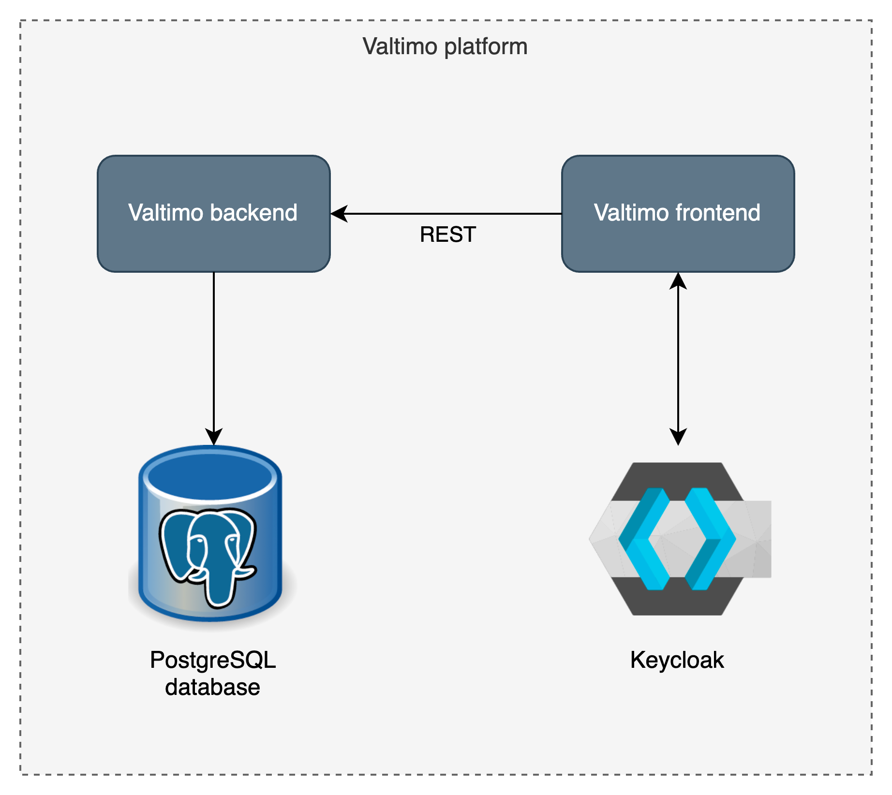

## Welcome to Valtimo

### What is Valtimo?

Valtimo is the low-code platform for Business Process Automation. Our goal is to make implementing
business process automation and case management easy.

### What does the Valtimo platform contain?

- Valtimo consists of two services:
  - A Spring Boot Java/Kotlin backend
  - An Angular frontend
- Valtimo depends on two services:
  - Keycloak as an identity and access provider
  - A database (default is PostgreSQL)

### What are the 'Valtimo frontend libraries'?

This repository contains:

- A collection of Angular libraries that together form the Valtimo frontend.
- The `app` module, containing an Angular application, used for library development.

### Starting the Valtimo platform

Starting up the Valtimo platform requires three steps:

1. Starting the supporting Docker containers: Keycloak and PostgreSQL. Instructions for starting the
   supporting services can be found
   [here](https://github.com/valtimo-platform/valtimo-backend-libraries/blob/next-minor/README.md#start-docker-containers-for-supporting-services).
2. Starting the Valtimo backend. Instructions can be found
   [here](https://github.com/valtimo-platform/valtimo-backend-libraries/blob/next-minor/README.md#starting-the-valtimo-backend-libraries-from-source)
3. Starting the Valtimo frontend. Instructions can be found
   [here](#starting-the-valtimo-frontend-libraries-from-source)

### Starting the Valtimo frontend libraries from source

#### Prerequisites: node

1. Install `nvm`. More information can be found [here](https://github.com/nvm-sh/nvm)
2. Install Node v20: `nvm install 20 && nvm use 20`

#### Install dependencies

Run the following command to install the dependencies: `npm install`.

#### Build libraries

Run the following command to build all the Valtimo libraries: `npm run libs-build-all`.

#### Start application

- Run the following command to start the Angular application: `npm start`.
- When this command has been completed, navigate to `http://localhost:4200/`

### Making changes to the Valtimo frontend libraries

When making changes to the libraries, the modified libraries have to be rebuilt. The following
command can be used to build one specific library: `npm run libs:build:libraryName`. Note: it is
possible to `watch` for changes in a specific library, building it automatically after a change has
been saved. For rebuilding automatically use the following command:
`npm run libs:watch:libraryName`.

The app will automatically reload if you change any of the source files.

### Code quality

#### Running the linter

To run TSLint on a specific library, run `npm run libs:lint:libraryName`.

#### Code formatting

Valtimo uses Prettier to format its code. Run the `prettier:check` command to check for formatting
errors, and `prettier:write` to automatically fix any errors.

We advise to configure your IDE to automatically format files on save.

- For IntelliJ IDEA please refer to
  [this page](https://www.jetbrains.com/help/idea/prettier.html#ws_prettier_install).
- For VS Code you can refer to
  [this guide](https://scottsauber.com/2017/06/10/prettier-format-on-save-never-worry-about-formatting-javascript-again/).

Please make sure your code conforms to the project's Prettier code formatting rules before raising a
Pull Request.

#### Running unit tests

Run the following command to run the unit tests: `npm run libs:test:libraryName`.

### Contributing

Contributions are welcome! To get you in the right direction, please consult the
[Valtimo documentation](https://docs.valtimo.nl/readme/contributing) for guidelines on how to
contribute.

#### Code guidelines

For contributing code, please refer to the [coding guidelines](CODING-GUIDELINES.md).

#### Branching strategy

For more information on what branches to create while working in this project, please refer to
[this page](https://github.com/valtimo-platform/valtimo-documentation/blob/next-minor/contributing/branching-and-release-strategy.md).

<!--- TODO: change url --->

### License

The source files in this repo are licensed under the
[EUPL 1.2](https://joinup.ec.europa.eu/collection/eupl/eupl-text-eupl-12). If you have any questions
about the use of this codebase in a larger work: please reach out through the
[Valtimo website](https://www.valtimo.nl/contact/).

### More information

- Website: https://www.valtimo.nl
- Documentation: https://docs.valtimo.nl
